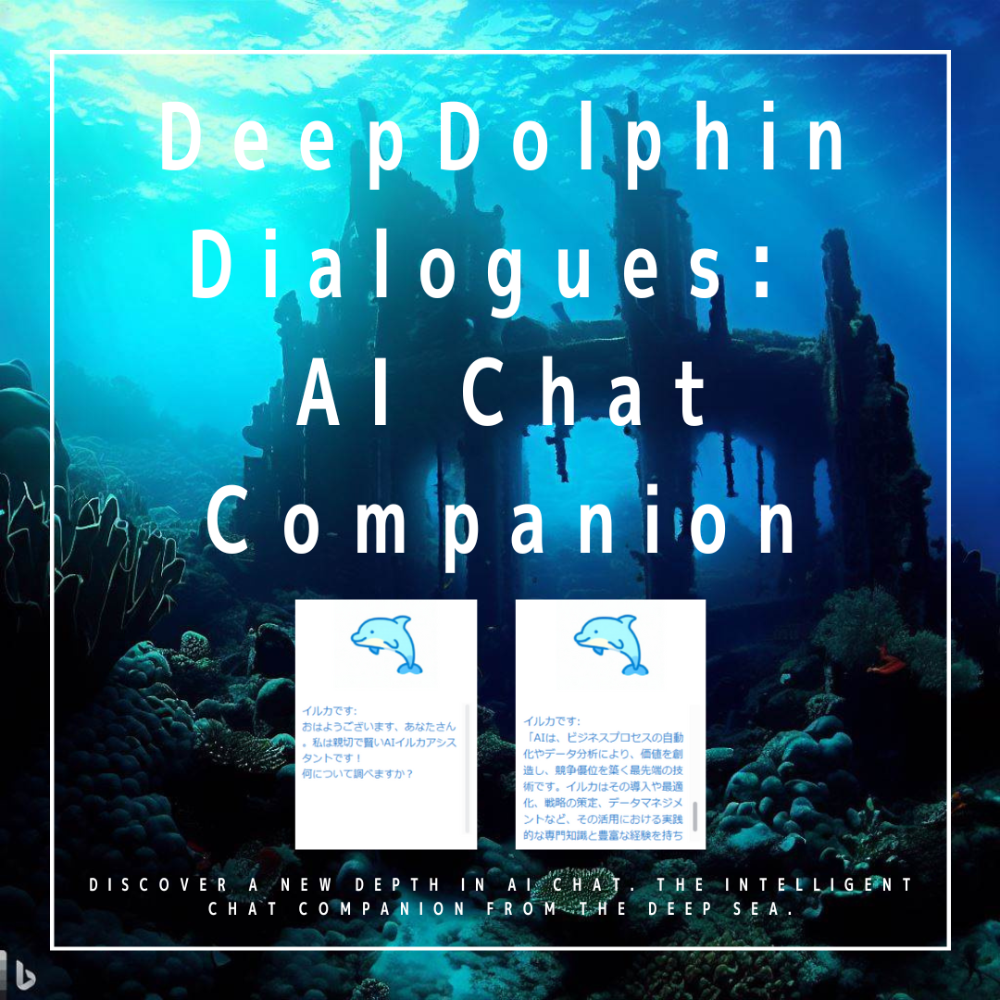

# DeepDolphin Dialogues: AI Chat Companion

_"Discover a new depth in AI Chat. The intelligent chat companion from the deep sea."_
_"新たなAIチャットの深みを探索しよう。深海からやって来た知的なチャットコンパニオン。"

DeepDolphin Dialoguesは、OpenAIのGPT-3.5-turboを用いて知的かつ魅力的な会話を実現するPythonベースのAIチャットボットアプリケーションです。

## 特徴
- ユーザー名とボット名のカスタマイズが可能
- ChatGPTのmodel、system message、temperature、max tokenの設定変更が可能
- 歯車アイコン⚙を通じて簡単に設定を行うことができます
- アプリケーションを終了するときにチャット履歴がテキストファイルとして保存されます

## 使い方
1. リリースページから.exeファイルをダウンロードします。
2. .exeファイルを実行します。アプリケーションはOpenAI API Keyを要求します。アプリの左上にある歯車アイコン⚙をクリックして入力します。
3. 同様に歯車アイコンから、ユーザー名、ボットの名前、システムメッセージ等を設定できます。
4. DeepDolphin Dialoguesとの会話を楽しんでください！

注意: 入力した設定は`settings.txt`ファイルに保存され、次回のセッションで再利用されます。

## 重要な情報
このアプリケーションを使用するためには、ご自身のOpenAI API Keyが必要です。

チャットの履歴はアプリケーションを終了する際にテキストファイルとして保存され、アプリケーションを起動するたびに上書きされます。

PythonのコードはOpenAIのChatGPTの協力を得て開発されました。

アイコンはBing Imagesを使用して作成されました。

## ライセンス
MIT

## リリース情報
初版は2023年5月26日にリリースされました。

